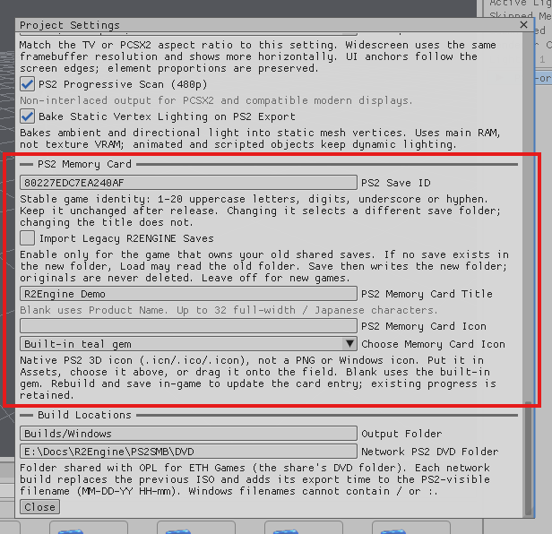

# Add a Save Point

A Save Point gives the player an intentional place to write supported game state to a PS2 memory card or desktop save.

## Project setup

Open Project Settings and configure the save title, save identifier, and PS2 memory-card icon. The identifier should remain stable after players begin making saves.

## Scene setup

1. Add or select the object that represents the save location.
2. Add a Save Point component.
3. Give it an interaction range or trigger collider that is easy to reach.
4. Add an optional prompt or Canvas explaining that the player can save.
5. Save the scene.

## Test saving

Move the player and change something persistent, then use the Save Point. Change the scene state again and load the save. The supported saved values should return to their saved state.

Reloading a scene is different from loading a save. A normal scene reload returns objects to their authored starting state. Loading a save restores the saved state.

Always test the memory-card presentation and loading behavior on real PS2 hardware before releasing a build.
