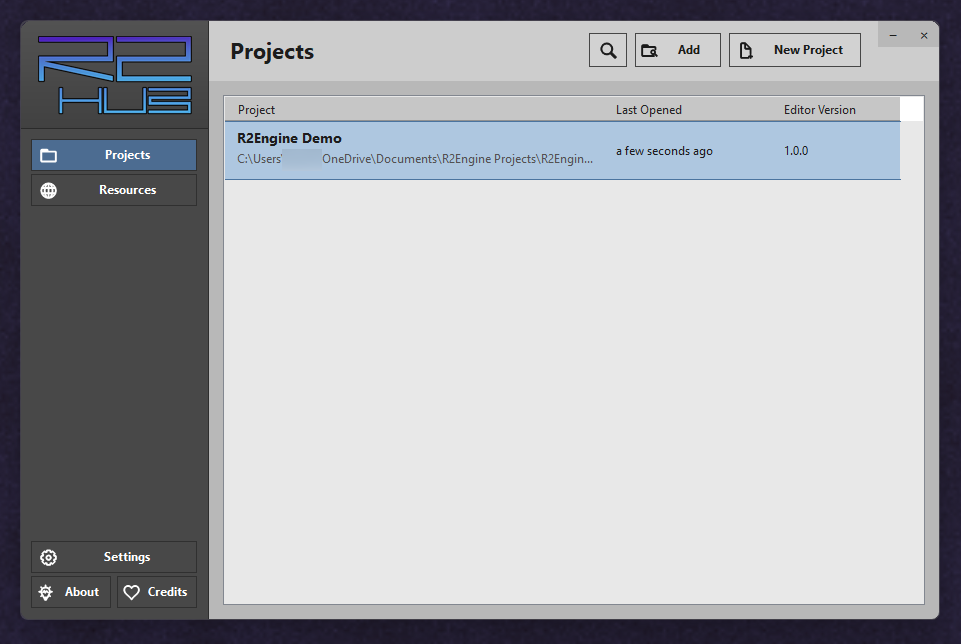
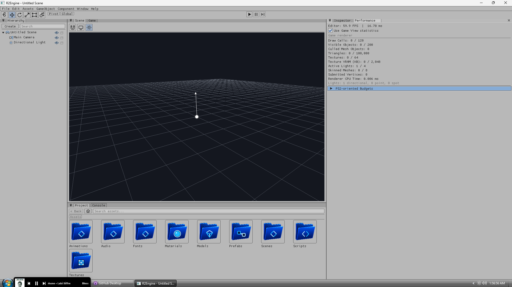
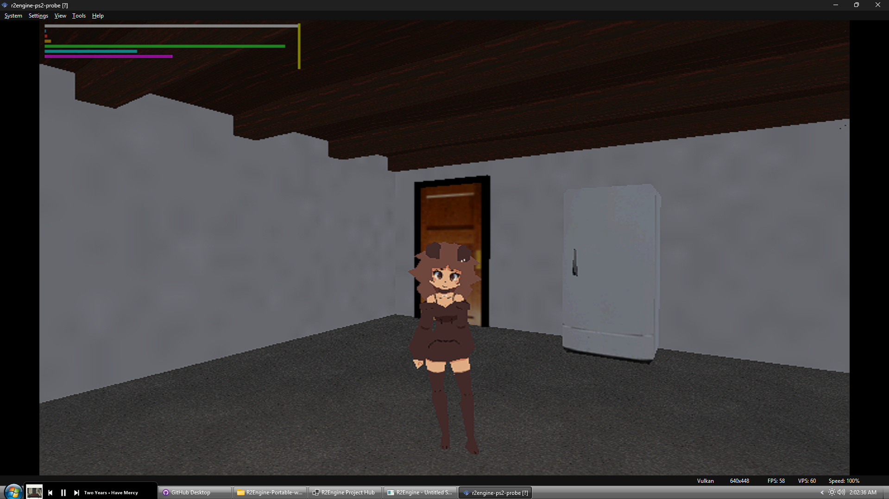

# R2Engine

R2Engine is a small 3D game engine for making games that can run on Windows and PlayStation 2. It combines a visual editor, a project Hub, a desktop player, and a native PS2 runtime in one workflow.

The goal is to make building a small PS2-style game approachable. You can create scenes, place objects, attach components, import assets, write gameplay scripts, test on Windows, and then build the same project for PCSX2 or compatible PS2 homebrew hardware.

**New here?** Start with the [R2Engine Quick Start](QUICKSTART.md).

## Gallery

| R2Engine Hub | R2Engine Editor |
| --- | --- |
|  |  |

### Running on PlayStation 2



## Project status

R2Engine is an early, actively developed project. It is usable for experiments and small games, but workflows, file formats, and features may still change. Expect rough edges and test your work regularly.

The current portable preview is intended for developers, curious testers, and small experimental projects.

## Known limitations

- The Hub and editor currently target 64-bit Windows. Other desktop platforms are not packaged or supported yet.
- Releases are unsigned, so Windows may show a security warning after download.
- There is no automatic updater. Portable releases must be downloaded and extracted manually.
- The project is pre-release software. Scene formats, project settings, scripting APIs, and editor workflows may change between versions.
- The native PS2 runtime does not yet have complete feature parity with Windows. Always test console-targeted scenes in PCSX2 and, when possible, on real hardware.
- PS2 builds require a separately installed PS2DEV environment with PS2SDK and gsKit. Final ISO packaging also relies on additional tools documented in the PS2 guide.
- A stock PlayStation 2 cannot boot unsigned homebrew software by itself. Real-hardware testing requires an appropriate homebrew launch method.
- Building R2Engine from source requires the .NET 10 SDK. The portable release includes the runtime needed for normal Hub and editor use.

## What it includes

- A project Hub for creating, organizing, searching, and opening projects
- A Unity-inspired editor with Hierarchy, Scene, Game, Inspector, Project, Console, and Performance views
- Scene objects built from reusable components
- Models, textures, materials, audio, fonts, animation, prefabs, and C# gameplay scripts
- Cameras, lighting, collision, player controls, interactables, UI canvases, scene loading, and saving
- In-editor play testing and standalone Windows builds
- Cooked PS2 builds for testing in PCSX2
- Final PS2 ISO packaging and development workflows for compatible homebrew hardware
- Built-in documentation aimed at first-time game creators

## A typical workflow

1. Create or add a project through the R2Engine Hub.
2. Import a room, character, or other game assets.
3. Build a scene using objects and components.
4. Add collision, lighting, a camera, and player controls.
5. Add gameplay with built-in components or C# scripts.
6. Test the game inside the editor.
7. Build for Windows, PCSX2, or compatible PS2 homebrew hardware.

R2Engine projects are kept separate from the engine itself. Each project contains its own `Assets`, `Scenes`, and project settings.

## Building from source

R2Engine currently targets Windows and requires the .NET 10 SDK.

Clone the repository and build the solution:

```powershell
git clone https://github.com/Rider-UwU-Black/R2Engine.git
cd R2Engine
dotnet build R2Engine.slnx
```

Then start the Hub:

```powershell
dotnet run --project R2Engine.Hub/R2Engine.Hub.csproj
```

The Hub launches the editor build from this repository and stores user-specific paths, appearance choices, and project locations outside the engine source.

## PlayStation 2 development

Windows testing does not require the PS2 toolchain. Building the native PS2 runtime requires a PS2DEV environment with PS2SDK and gsKit. PCSX2 can be configured from the Hub settings.

R2Engine can produce development builds for PCSX2 and package a final ISO, but a stock PlayStation 2 cannot boot unsigned homebrew software by itself. Real-hardware testing requires an appropriate homebrew launch method.

For the lower-level toolchain notes, see [R2Engine.PS2/README.md](R2Engine.PS2/README.md).

## Documentation

The included manual begins with the basics and works toward building a small playable game. Start with:

- [Welcome to R2Engine](Docs/Manual/01%20Welcome%20to%20R2Engine.md)
- [Editor and Project Basics](Docs/Manual/02%20Editor%20and%20Project%20Basics.md)
- [Make a Small Playable Scene](Docs/Manual/03%20Make%20a%20Small%20Playable%20Scene.md)
- [Build and Test on PS2](Docs/Manual/07%20Build%20and%20Test%20on%20PS2.md)

The complete manual is available in [Docs/Manual](Docs/Manual).

## Contributing and feedback

R2Engine is still taking shape. Bug reports, testing notes, and thoughtful feedback are welcome. Contribution guidelines and issue templates will be added as the public project matures.

## License

R2Engine is released under the [MIT License](LICENSE). You are free to use, modify, and distribute it, including in commercial projects, as long as the license and copyright notice are preserved.

## Acknowledgements

R2Engine is built with open-source libraries and tools including Silk.NET, Dear ImGui through ImGui.NET, Roslyn, AssimpNetter, StbImageSharp, ImageSharp, OpenAL Soft, PS2SDK, and gsKit. Full licensing and attribution details are available from the Credits page in the R2Engine Hub.

R2Engine is an independent homebrew project and is not affiliated with or endorsed by Sony Interactive Entertainment.
